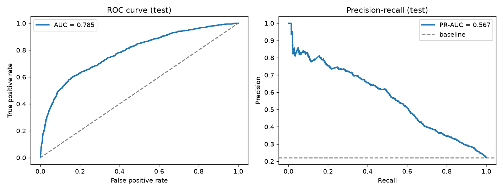
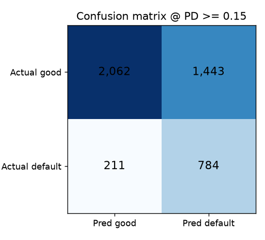
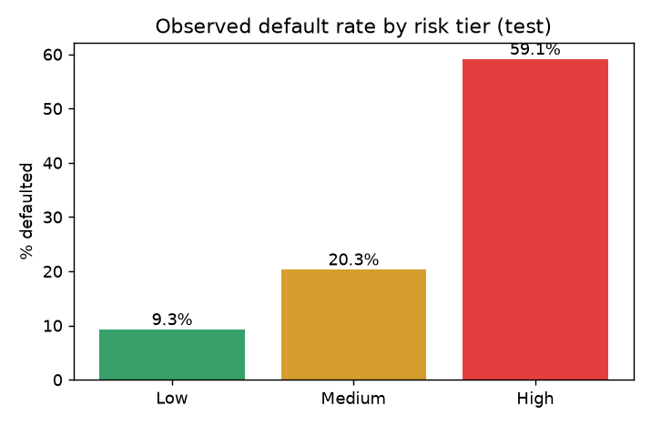
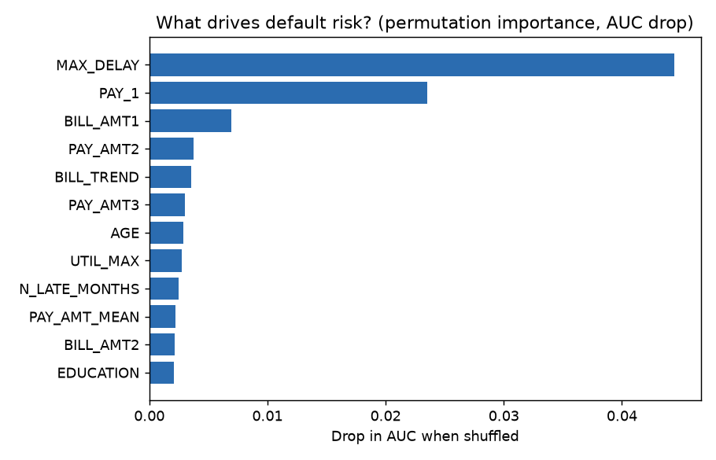
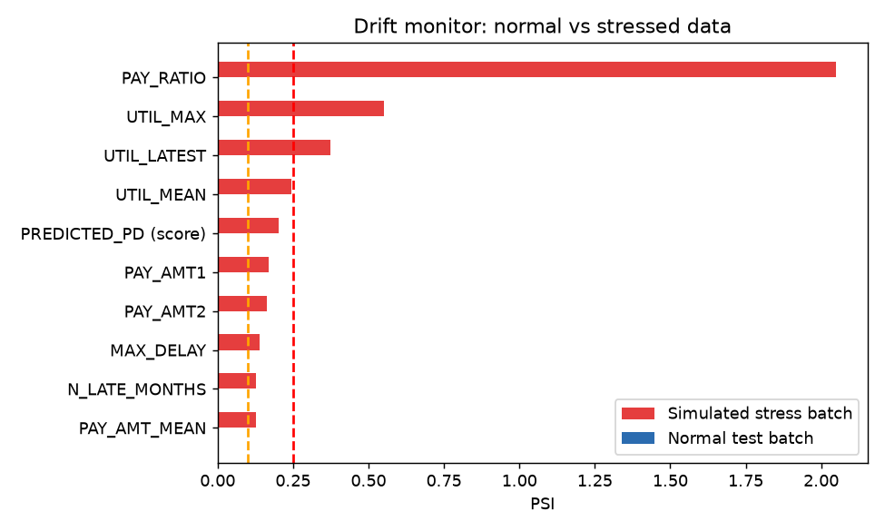

# Credit Default Early-Warning System: Auto-Generated Report
_Generated 2026-10-08T11:00:57 by `run_pipeline.py`. Nothing in this file is typed by hand._

## 1. Data quality
30,000 clients, 25 columns, 0 missing values, 0 duplicate IDs.
Default rate **22.1%**. Cleaning actions: {'EDUCATION 0/5/6 -> 4 (other)': 345, 'MARRIAGE 0 -> 3 (other)': 54}.

## 2. Model selection (validation set)
| model | val_roc_auc | val_pr_auc |
|---|---|---|
| Gradient Boosting (tuned) | 0.7888 | 0.5673 |
| Random Forest | 0.7869 | 0.5685 |
| Logistic Regression | 0.7680 | 0.5345 |

Selected: **Gradient Boosting (tuned)**. Decision threshold **PD >= 0.15**, chosen on validation to minimise cost
(missed default costs 5x a wrongly declined good client).

## 3. Final performance on untouched test set
| Metric | Value |
|---|---|
| ROC-AUC | 0.785 |
| Gini | 0.570 |
| KS statistic | 0.438 |
| PR-AUC | 0.567 |
| Brier score | 0.133 |
| Recall (defaults caught) | 78.8% |
| Precision | 35.2% |
| Cost vs. approving everyone | **49.8% lower** |

## 4. Risk tiers
| Tier | clients | avg_predicted_pd | actual_default_rate |
|---|---|---|---|
| Low | 2273 | 0.088 | 0.093 |
| Medium | 1373 | 0.215 | 0.203 |
| High | 854 | 0.571 | 0.591 |

## 5. What drives risk

## 6. Fairness audit (attributes excluded from the model, audited afterwards)
| attribute | group | n | actual_default_rate | flagged_high_risk_rate | avg_predicted_pd | recall |
|---|---|---|---|---|---|---|
| SEX | 1 | 1796 | 0.239 | 0.530 | 0.230 | 0.816 |
| SEX | 2 | 2704 | 0.209 | 0.472 | 0.211 | 0.766 |
| EDUCATION | 1 | 1610 | 0.193 | 0.422 | 0.191 | 0.756 |
| EDUCATION | 2 | 2081 | 0.234 | 0.529 | 0.233 | 0.809 |
| EDUCATION | 3 | 748 | 0.258 | 0.587 | 0.246 | 0.798 |
| EDUCATION | 4 | 61 | 0.066 | 0.115 | 0.100 | 0.250 |
| MARRIAGE | 1 | 2074 | 0.240 | 0.502 | 0.222 | 0.801 |
| MARRIAGE | 2 | 2375 | 0.205 | 0.489 | 0.216 | 0.775 |
| MARRIAGE | 3 | 51 | 0.196 | 0.490 | 0.216 | 0.800 |
| AGE_BAND | 30-39 | 1612 | 0.202 | 0.438 | 0.198 | 0.739 |
| AGE_BAND | 40-49 | 1009 | 0.240 | 0.510 | 0.223 | 0.789 |
| AGE_BAND | 50+ | 422 | 0.251 | 0.581 | 0.243 | 0.840 |
| AGE_BAND | <30 | 1457 | 0.220 | 0.522 | 0.230 | 0.819 |

## 7. Drift monitoring
Normal test batch: **0** PSI alerts. Simulated economic-stress batch: **3** alerts
(PSI watch >= 0.1, alert >= 0.25). An alert is the trigger to retrain.

